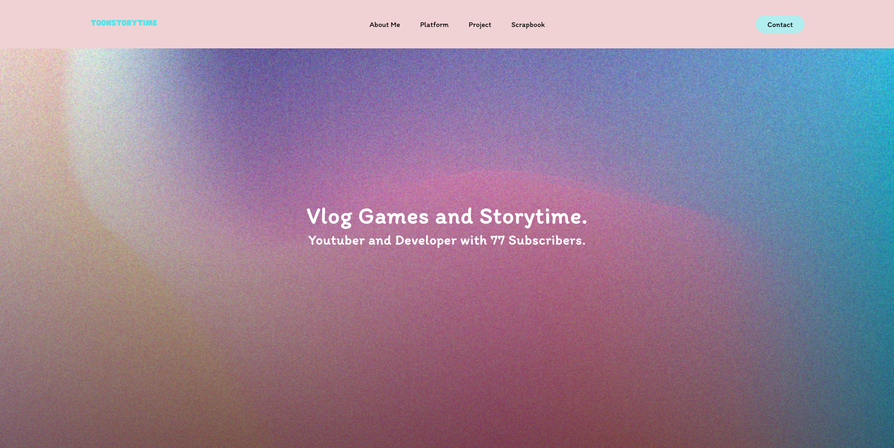
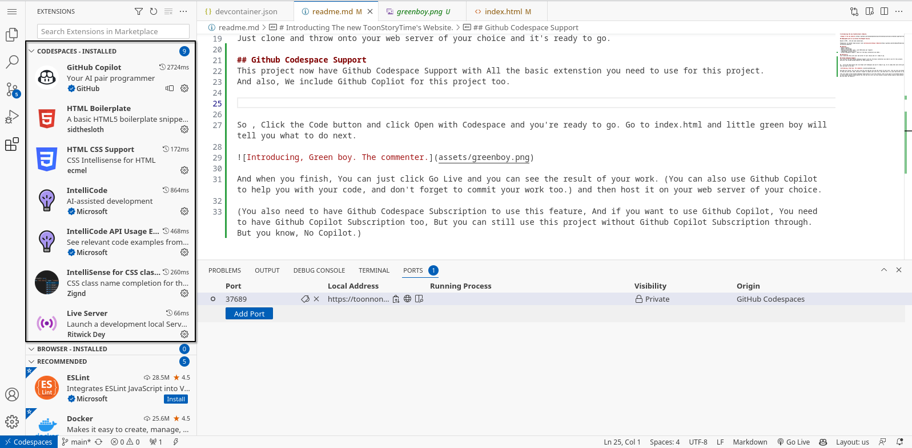
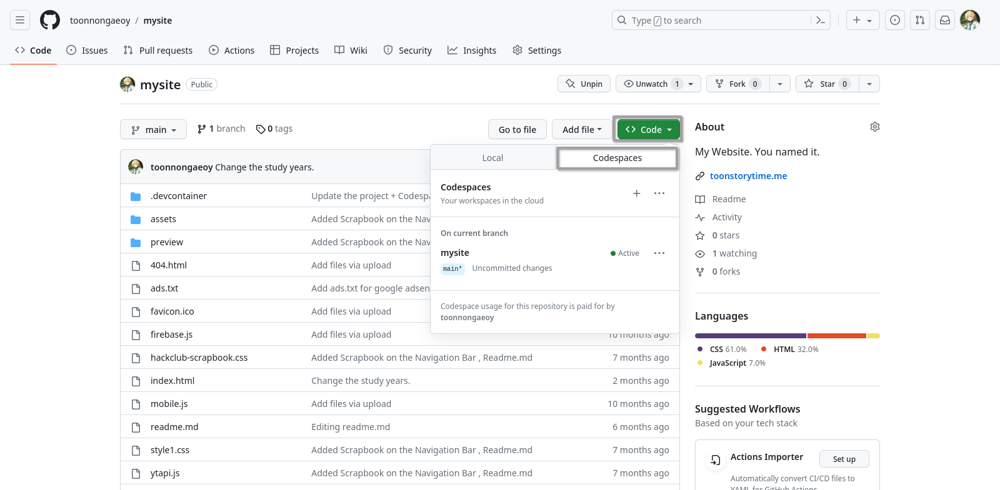
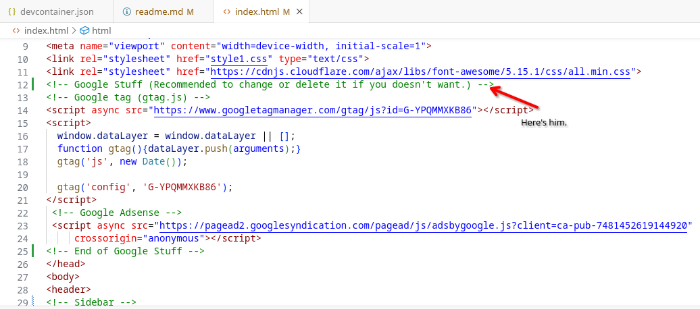
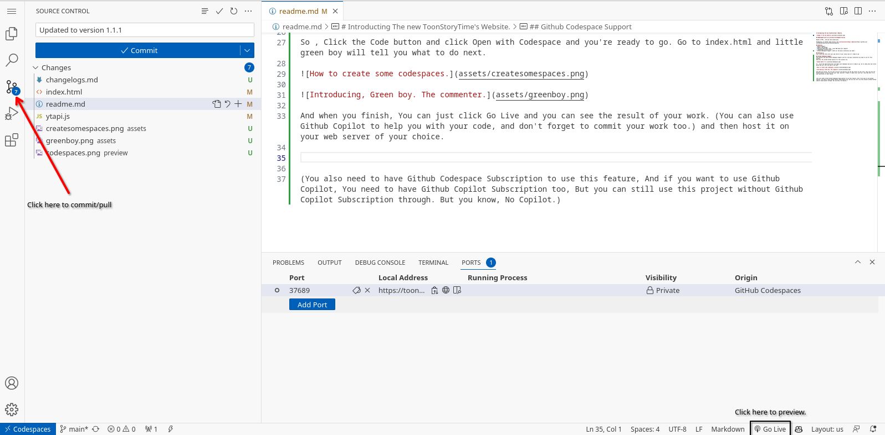

# ‼️ This site going to have a new look , and also using new programming language soon. And all the info won't update anymore. So, stay tuned. ‼️

# Introducting , ToonStoryTime's Website.

## Redesigned with ❤️ by Cartoon Kritthapath Yaviraj

Based on HTML , CSS and some JavaScripts.

Predecessor of another dead project like [CartoonLove****Kung's Website](https://github.com/StoryHouseProduction/CartoonLove.Website)

## Features
- Mobile Support.
- Modern look design.
- Realtime Subscriber count. (with 808 bytes per request)
- Lightweight (Around 10 kb.)
- Github Codespaces Support. (With all the basic extenstion you need.)

## Setting up
Just clone and throw onto your web server of your choice and it's ready to go.

## Github Codespace Support
This project now have Github Codespace Support with All the basic extenstion you need to use for this project.
And also, We include Github Copliot for this project too.

So , Click the Code button and click Open with Codespace and you're ready to go. Go to index.html and little green boy will tell you what to do next. 

And when you finish, You can just click Go Live and you can see the result of your work. (You can also use Github Copilot to help you with your code, and don't forget to commit your work too.) and then host it on your web server of your choice.

(You also need to have Github Codespace Subscription to use this feature, And if you want to use Github Copilot, You need to have Github Copilot Subscription too, But you can still use this project without Github Copilot Subscription through. But you know, No Copilot.)